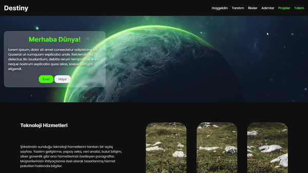

# Destiny-web-site

**Başlık:** DESTINY

**Açıklama:** Bu web sitesi, frontend dersi için hazırlanmış bir proje ödevinden oluşmaktadır.

3 sayfadan oluşan bu web sitesi, yeşil ve siyah renkleri kullanılarak tasarlanmıştır. Bu renk paleti, dinamik ve çarpıcı bir atmosfer oluşturmayı amaçlamaktadır.

**Genel Görsel:**

**Temel Bilgiler:**

* **Tasarım:** Sitemiz responsive bir tasarıma sahip ve 3 sayfadan oluşuyor.
* **Renk Paleti:** yeşil , siyah ve mavi  renkleri kullanılarak tasarlanmıştır.
* **Kullanılan Teknolojiler:**
    * HTML
    * CSS
    * SCSS

**Sayfalar:**

## Hoş Geldin

## Tanıtım

## İlkeler

## Adımlar

## Projeler

## Ana Sayfa

## Destekcilerimiz

* **Kullanılan Teknolojiler:**
    * HTML
    * CSS
    * JavaScript

# Responsive
 

# Renkler

 

